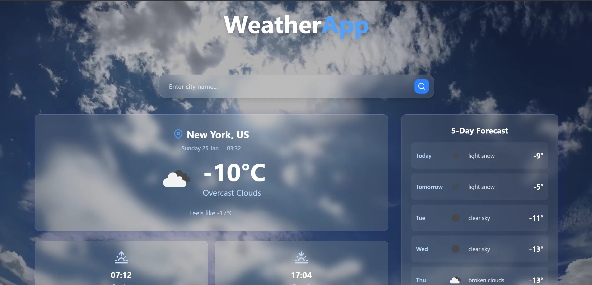

<div align="center">
<h1 align="center">🌤️ Weather App</h1>


A modern, beautiful weather web application built with **React**, **TypeScript**, and **Tailwind CSS** featuring a video background and glassmorphism design and provided data using the OpenWeather API.

<a href="https://weather-app-project-psi-two.vercel.app/" target="_blank"><strong>➥ Live Demo</strong></a>

</div>

<br />

### Demo Screeshot



---

## ✨ Features

- 🎨 Modern glassmorphism design with video background
- 🌟 Smooth animations and transitions
- 📱 Fully responsive design
- 🔍 Real-time city search
- 📊 Comprehensive weather information
- 🌅 Sunrise/sunset times
- 💨 Wind speed, humidity, pressure, and visibility
- ⚡ Fast and lightweight

## 🛠️ Technologies Used

- **React** - Modern React with hooks
- **TypeScript** - Type-safe JavaScript
- **Tailwind CSS** - Utility-first CSS framework
- **Vite** - Fast build tool
- **React Icons** - Beautiful icon library
- **OpenWeatherMap API** - Weather data provider

## Design Features

- **Video Background**: Dynamic nature video background
- **Glassmorphism**: Modern blur-glass effect cards
- **Animations**: Smooth fade-in and hover effects
- **Responsive**: Works perfectly on all device sizes
- **Accessibility**: Proper contrast and semantic HTML

---

## 🚀 Getting Started

Follow these steps to run the project locally on your machine.

### Prerequisites

- Node.js
- npm or yarn

### Installation

1.  **Clone the repository:**

    ```bash
    git clone https://github.com/Amine4jh/weather-web-app-ts.git
    cd weather-web-app-ts
    ```

2.  **Install dependencies:**

    ```bash
    npm install
    # or
    yarn install
    ```

3.  **Run the development server:**

    ```bash
    npm run dev
    # or
    yarn dev
    ```

4.  Open [http://localhost:5173](http://localhost:5173) with your browser to see the result.

---

## ⚙️ Configuration

1.  Create a `.env` file in the root directory.
2.  Add your OpenWeather Token:
    ```env
    VITE_WEATHER_API_KEY=your_token_here
    VITE_WEATHER_BASE_URL=https://api.openweathermap.org/data/2.5/
    VITE_GEO_BASE_URL=http://api.openweathermap.org/geo/1.0/
    ```

---

## 👤 Author

**Amine Ajaha**

GitHub: @Amine4jh

LinkedIn: [Amine Ajaha](https://www.linkedin.com/in/amineajaha/)

---

## 📄 License

This project is open source and available under the MIT License.
